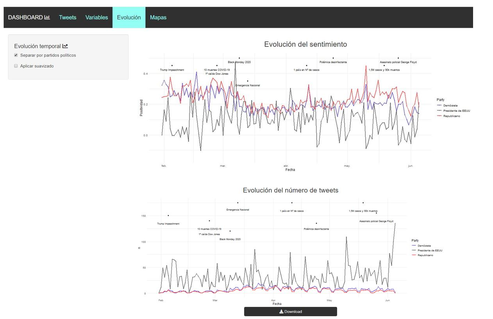

# US Tweets Dashboard for Sentiment Analysis

Shiny dashboard developed in R for sentiment analysis of US president and governors' tweets during the early stages of the pandemic.

## Description

This is a project developed for my Data Science's Master's (that's why it is in Spanish). 

The idea is to be able to study interactively the relationship between the sentiment and the amount of tweets posted by the president of the US and the 50 governors thruought the early stages of the 2020 pandemic. 
Some other variables are included like Dow Jones index or the dollar-to-euro value.

In order to do this +46.000 tweets were downloaded from the 1st of February to the 1st of June.

## Tabs

### Tweets

Here you can see the most negative and positive tweets by selecting a date interval and the political party (Democratic, Republican or President).

   

### Variables

In this tab it is possible to study the distribution of the tweet's sentiment of each political party.
It is also possible to visualize all the time series used in this project and how correlated they are through a correlation matrix.

   

### Evolution

Here it is possible to study the evolution of the average sentiment and number of tweets of each political party from February to June. 
Some important events are showed in the plot such as President's impeachment or *"Black Monday"*.
There are two buttons that allow you to split the data between parties and/or apply some smoothing to the time series.

   

### Maps

In this tab you can check wheter a specific state's governor is Republican or Democratic.
Next to it another map shows the number of tweets or the average sentiment of each state's governor between two dates defined by the user.

   

## Usage

Clone the repository and run the app.R file. 

All the required packages will be downloaded when you run the app if they aren't yet.
